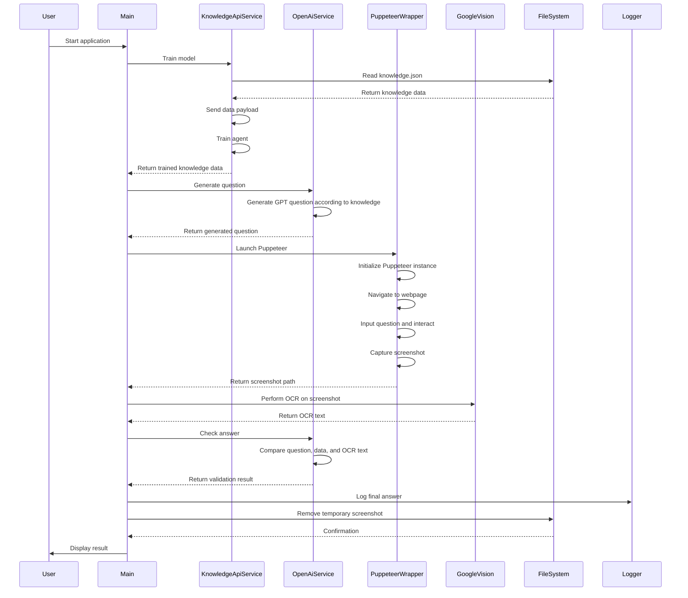

# OneReach
## Process Flow

Below is a sequence diagram illustrating the main process flow of the application:

```mermaid
sequenceDiagram
    participant User
    participant Main
    participant KnowledgeApiService
    participant OpenAiService
    participant PuppeteerWrapper
    participant GoogleVision
    participant FileSystem

    User->>Main: Start application
    Main->>KnowledgeApiService: Train model
    KnowledgeApiService->>FileSystem: Read knowledge.json
    FileSystem-->>KnowledgeApiService: Return knowledge data
    KnowledgeApiService->>KnowledgeApiService: Send data payload
    KnowledgeApiService->>KnowledgeApiService: Train agent
    KnowledgeApiService-->>Main: Return trained knowledge data

    Main->>OpenAiService: Generate question
    OpenAiService->>OpenAiService: Generate GPT question according to knowledge
    OpenAiService-->>Main: Return generated question

    Main->>PuppeteerWrapper: Launch Puppeteer
    PuppeteerWrapper->>PuppeteerWrapper: Initialize Puppeteer instance
    PuppeteerWrapper->>PuppeteerWrapper: Navigate to webpage
    PuppeteerWrapper->>PuppeteerWrapper: Input question and interact
    PuppeteerWrapper->>PuppeteerWrapper: Capture screenshot
    PuppeteerWrapper-->>Main: Return screenshot path

    Main->>GoogleVision: Perform OCR on screenshot
    GoogleVision-->>Main: Return OCR text

    Main->>OpenAiService: Check answer
    OpenAiService->>OpenAiService: Compare question, data, and OCR text
    OpenAiService-->>Main: Return validation result

    Main->>Logger: Log final answer
    Main->>FileSystem: Remove temporary screenshot
    FileSystem-->>Main: Confirmation
    Main->>User: Display result

```
